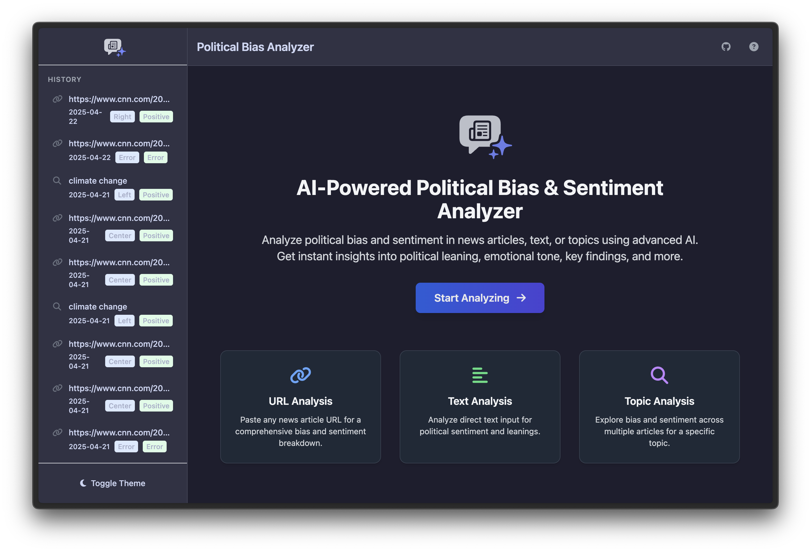

 
# Political Bias and Sentiment Detection Web App

## Overview

This project is a capstone project for CS 273: Natural Language Processing at SJSU focused on building a Python-based Flask web application designed to analyze news articles and text for political bias and sentiment. It leverages natural language processing techniques, using specialized models for classification and a large language model (LLM) for generative tasks like summarization and finding key insights.

The goal is to provide users with an intuitive interface to gain insights into the framing and tone of news content obtained from various sources.

## Features

Users can interact with the application in three ways:

1.  **Direct Text Input**: Paste a block of text directly into the application for analysis.
2.  **URL Input**: Provide a URL to an online news article. The application will scrape the content and analyze it.
3.  **Topic Input**: Submit a research topic. The application uses DuckDuckGo Search to find relevant articles, scrapes them, and provides an aggregated analysis (currently analyzing the top few articles found).

The application outputs the following for the analyzed text:

* **Sentiment Analysis**: Classifies the text as Positive, Negative, or Neutral.
* **Political Bias Detection**: Assigns a political bias label (Left, Right, or Center).
* **Summarization**: Generates a concise summary of the article text.
* **Key Findings**: Extracts key points or conclusions from the text.
* **Bias Indicators**: Lists specific phrases or arguments from the text that seem indicative of potential bias.
* **Credibility Assessment**: Provides a brief textual assessment of the content's likely credibility based on language and presentation.
* **Recommended Searches**: Suggests related search terms for further exploration.
* **Visualizations**: Displays interactive charts showing sentiment and bias distribution (more relevant for topic analysis).
* **History**: Saves recent analyses for easy review and reloading.

## Political Bias and Sentiment Detection Web App 
Homepage of the App



## Models Used

This application utilizes a hybrid approach, combining specialized models hosted on the Hugging Face Inference API with a general-purpose Large Language Model accessed via the Together AI API.

1.  **Sentiment Analysis:**
    * **Model:** `siebert/sentiment-roberta-large-english`
    * **Source:** Hugging Face Inference API
    * **Link:** [https://huggingface.co/siebert/sentiment-roberta-large-english](https://huggingface.co/siebert/sentiment-roberta-large-english)
    * **Purpose:** Classifies the overall sentiment of the input text (Positive, Negative, Neutral).

2.  **Political Bias Detection:**
    * **Model:** `bucketresearch/politicalBiasBERT`
    * **Source:** Hugging Face Inference API
    * **Link:** [https://huggingface.co/bucketresearch/politicalBiasBERT](https://huggingface.co/bucketresearch/politicalBiasBERT)
    * **Purpose:** Classifies the political leaning of the input text (Left, Right, Center).

3.  **Generative Tasks (Summary, Findings, Indicators, Credibility, Searches):**
    * **Model:** `meta-llama/Llama-3-8b-chat-hf` (or similar capable instruction-tuned model)
    * **Source:** Together AI API
    * **Link:** [https://huggingface.co/meta-llama/Llama-3-8b-chat-hf](https://huggingface.co/meta-llama/Llama-3-8b-chat-hf) (Model details)
    * **Platform:** [https://api.together.ai/](https://api.together.ai/)
    * **Purpose:** Generates the text summary, extracts key findings, identifies potential bias indicators (phrases), provides a textual credibility assessment, and suggests related search terms based on analyzing the input text via structured prompting.

## Setup Instructions

1.  **Clone the Repository:**
    ```bash
    git clone <your-repo-url>
    cd nlp-capstone
    ```

2.  **Create a Virtual Environment (Recommended):**
    ```bash
    python -m venv venv
    source venv/bin/activate  # On Windows use `venv\Scripts\activate`
    ```

3.  **Install Dependencies:**
    ```bash
    pip install -r requirements.txt
    ```

4.  **Obtain API Keys:**
    * **Hugging Face:**
        * Sign up or log in at [https://huggingface.co/](https://huggingface.co/).
        * Go to your Settings -> API Tokens ([https://huggingface.co/settings/tokens](https://huggingface.co/settings/tokens)).
        * Create a **New token** with the "read" role.
        * Copy the generated token immediately.
    * **Together AI:**
        * Sign up or log in at [https://api.together.ai/](https://api.together.ai/).
        * Navigate to the API Keys section in your account settings.
        * Click "Create API Key".
        * Copy the generated key immediately.

5.  **Configure Environment Variables:**
    * Create a file named `.env` in the root directory of the project (the same directory as `app.py`).
    * Add your copied API keys to this file:
        ```dotenv
        # .env file content

        # Get from [https://api.together.ai/](https://api.together.ai/)
        TOGETHER_API_KEY=your_together_ai_key_here

        # Get from [https://huggingface.co/settings/tokens](https://huggingface.co/settings/tokens)
        HF_API_KEY=your_hugging_face_api_token_here
        ```
    * **Important:** Add `.env` to your `.gitignore` file to prevent accidentally committing your keys.

6.  **Run the Application:**
    ```bash
    python app.py
    ```
    The application should now be running (usually at `http://127.0.0.1:5000` or `http://0.0.0.0:5000`).

## Project Structure


nlp-capstone/
├── app.py                 # Main Flask application (backend logic)
├── web_scraper/
│   └── main.py             # Web scraping and DuckDuckGo search functions
├── templates/
│   ├── base.html           # Base HTML template (common layout)
│   └── index.html          # Main homepage for user input and results
├── static/
│   ├── css/
│   │   └── style.css       # Custom CSS styles and theme variables
│   ├── js/
│   │   └── script.js       # Frontend JavaScript logic
│   ├── data/
│   │   └── history.json    # Stores previous analysis history (auto-created)
│   └── images/
│       ├── light-logo.svg
│       ├── dark-logo.svg
│       └── favicon.ico     # App icons and logos
├── docs/
│   └── screenshot.png      # UI Screenshot (for README display)
├── requirements.txt        # Python dependencies
├── .env                    # API keys (you must create manually)
├── .gitignore              # Files to ignore in Git (e.g., .env, __pycache__)
└── README.md               # Project overview and instructions


## Notes

* The Hugging Face Inference API free tier may have rate limits or require models to "wake up" (causing initial delays or 503 errors). The application includes basic retry logic for this.
* Ensure you have placed the necessary image assets (`light-logo.svg`, `dark-logo.svg`, `favicon.ico`) in the `static/images/` directory.
* Update the screenshot path in the "Screenshot" section with your actual file.

